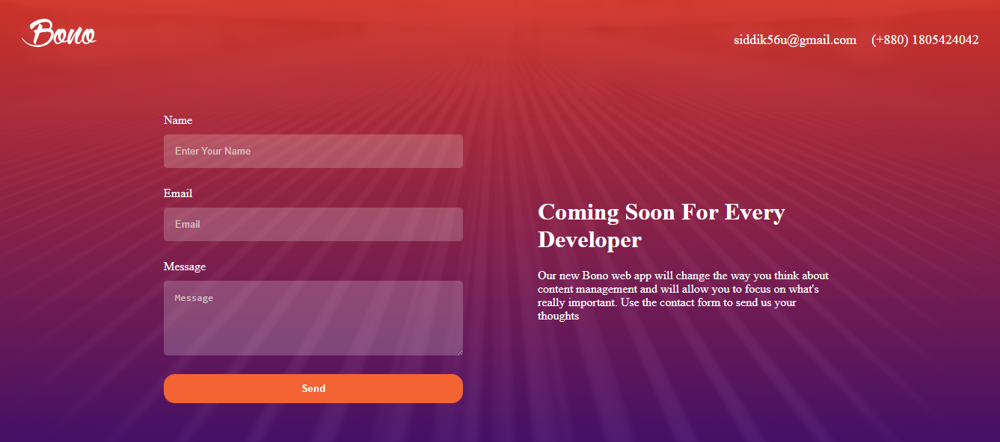
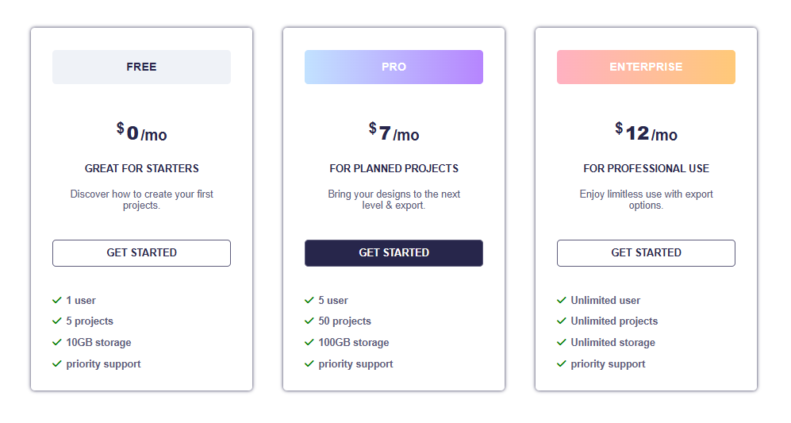

# Modern HTML & CSS From The Beginning 2.0🚀

This repository contains my practice projects and learning materials from the Udemy course **"Modern HTML & CSS From The Beginning 2.0"** by Brad Traversy. Each folder includes hands-on exercises and mini-projects built while mastering modern web development fundamentals — including HTML5, CSS3, Flexbox, Grid, responsive design etc.

This course was completed as part of my professional development training at **Bangladesh Software Solution(BSS).**
***

## 📁 Project Overview

This repository includes multiple small to medium-sized projects designed to strengthen the understanding of:
- Semantic HTML5 structure
- Modern CSS layout techniques using Flexbox/Grid.
- Responsive web design with media queries
- used FormSpree for contact form submit
- Created animations using CSS transitions, transforms, and keyframes
- Utility classes and reusable CSS components
- Integrated icons and external fonts (Font Awesome, Google Fonts)
- Organized projects with clean, maintainable folder structures

## 📋 Project List

| Project Name | Description | Live Demo | Source Code |
|---------------|----------|-------------|-----------------|
| **TuTor** | A video course platform for mastering in-demand professional skills with hands‑on, project‑based lessons. | [Link](https://tutor77.netlify.app/) | [Visit](https://github.com/Abs-Shagor/HTML_CSS_BY_UDEMY_x_BSS/tree/main/13-Tutor-Project) |
| **Lumina Creative** | A layout with navigation, image gallery, about, contact and footer sections. | [Link](https://lumina77.netlify.app/) | [Visit](https://github.com/Abs-Shagor/HTML_CSS_BY_UDEMY_x_BSS/tree/main/10-Lumina-Creative-Website) |
| **Bono App**        | A responsive contact form with gradient background. | [Link](https://bonoapp77.netlify.app/) | [Visit](https://github.com/Abs-Shagor/HTML_CSS_BY_UDEMY_x_BSS/tree/main/8-Bono-Landing-Form-Mini-Project) |
| **Pricing Grid**    | A simple responsive pricing grid layout. | [Link](https://pricinggrid77.netlify.app/) | [Visit](https://github.com/Abs-Shagor/HTML_CSS_BY_UDEMY_x_BSS/tree/main/7-Pricing-Grid-Challenge) |


## 🛠️ Technologies Used
- HTML5
- CSS3
- VS Code
- FormSpree
- Google Fonts
- Font Awesome
- Netlify / Vercel for hosting

## 📸 Screenshots

## TuTor


## Lumina Creative Website


## Bono App


## Pricing Grid



## 🧑‍💻 How to Use
1. Clone the repository
```bash
git clone https://github.com/Abs-Shagor/HTML_CSS_BY_UDEMY_x_BSS.git
```
2. Navigate to the project folder:
```bash
cd repository-name
```
3. Open the project in VS Code (or your preferred editor):
```bash
code .
```
4. Open any index.html file directly in your browser to view the project.
5. Practice by modifying layouts, styles, and adding new features.

## 🧠 What I Learned

#### HTML5
- Writing clean, semantic HTML5 code
- Creating accessible, well-structured documents

#### CSS3
- Styling modern, responsive layouts using CSS3
- Using Flexbox and Grid for complex, responsive layouts 
- Creating CSS Transitions for smooth hover effects.
- Implementing CSS Transforms (translate, rotate, scale)
- Building Keyframe Animations with `@keyframes` for complex animations
- Practical use of icons and external fonts (Font Awesome, Google Fonts)

#### UI Components
- Reusable components
- Animated hamburger menus
- Interactive navigation

#### JavaScript
- Basic DOM manipulation

#### Project Skills
- Scalable project structure
- Responsive design principles
- Git/GitHub workflow
- Debugging and optimization
- Real-time message sending via Formspree

## 🧾 Acknowledgements
I would like to express my gratitude to:
- **Ahmmad Asheq Bin Mazib** and **Bangladesh Software Solution (BSS)** for giving me the opportunity and support to complete this Udemy course as part of my professional development
- **Brad Traversy** for creating and teaching the "Modern HTML & CSS From The Beginning 2.0" course
